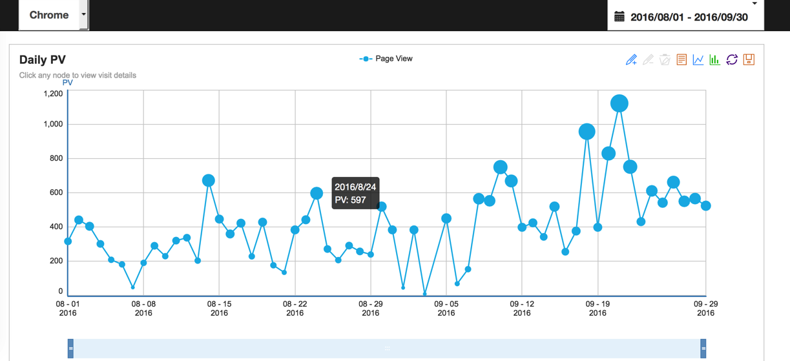
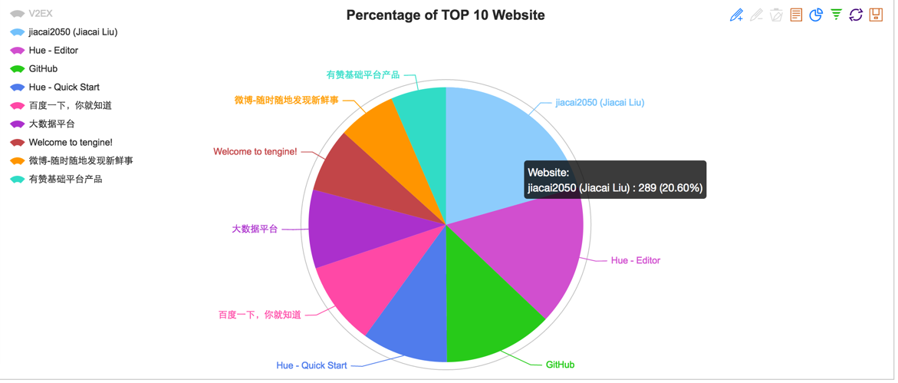
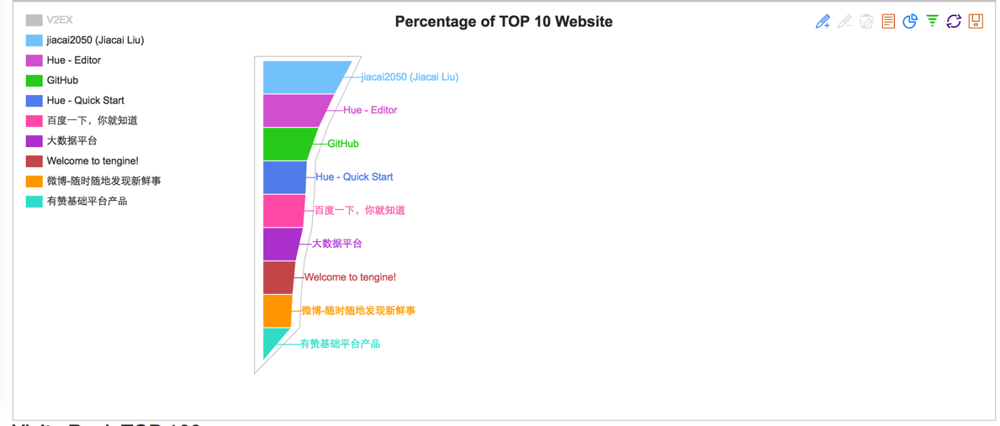
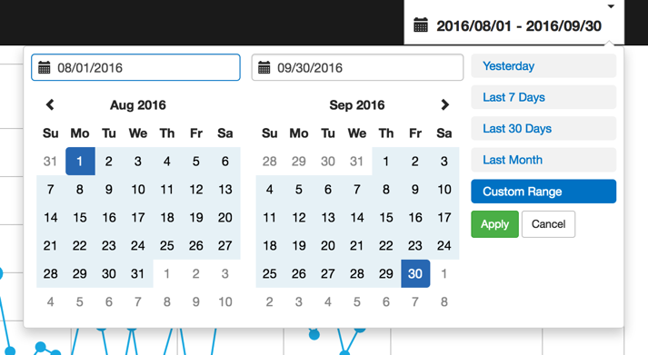

## better-history

[](https://nodei.co/npm/better-history/)

> 💡 Get a better sense of browsing history via Chrome/Firefox 💡

[英文文档](./README.md)

## 特点

- 
- 
- 
- 


## 使用方式

```        
npm install better-history -g
```

- 开启本地 Server，然后访问 http://localhost:4455

```
better-history
```

- 导出分析数据到 csv 文档

```
better-history export
```        

- 运行`better-history [server | export] -h` 来设置不同子命令的参数。

## TODO

- [x] 提供对 Firefox 的分析。（2016-01-16 完成）
- [x] 提供`搜索关键字`相关信息的展示。个人觉得没什么价值，所以不做了。
- [x] 发布到 [npm](https://www.npmjs.com/package/better-history) （2016-10-02 完成）
- [ ] 提供更丰富的图表展示📈


## License
[MIT](http://liujiacai.net/license/MIT.html?year=2016)

Echarts 版权归[百度](https://github.com/ecomfe/echarts/blob/master/LICENSE.txt)所有
