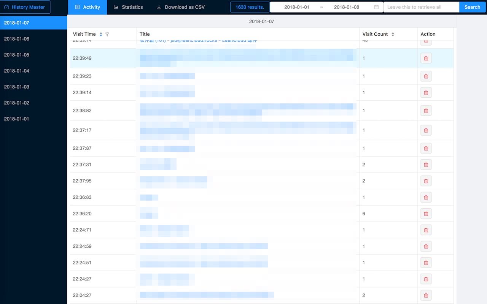
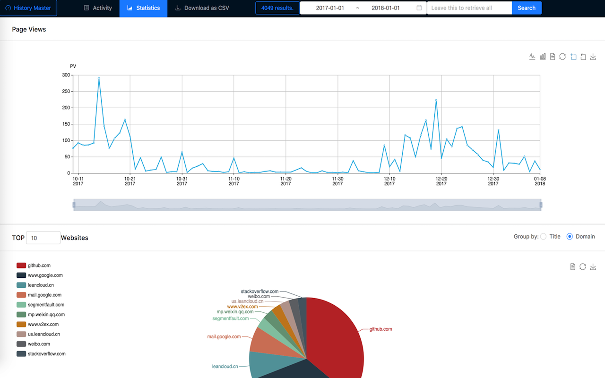
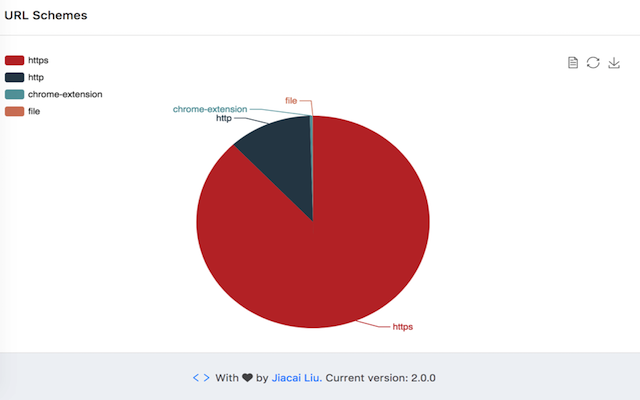

## History Master    

> 💡 Visualize browsing history, Discover your unknown habits, downloads supported.

> 🏆 Try to be the best practical history manager ever! 

[Open an issue](./issues/new) If you have any problems/suggestions. 💗

## Install

- [Chrome Web Store](https://chrome.google.com/webstore/detail/advanced-history/mkfgjjeggnmkbobjmelbjhdchcoadnin)
- [Mozilla Add-ons](https://addons.mozilla.org/firefox/addon/history-master/)

## Features

- Advanced search/filter/sort functions

    1. Search by date range and keyword
    2. Filter by hour in one day
    3. Sort by visit time or visit count

- Inspiring chart views

    1. Line chart for page views
    2. Pie chart for top-n visited website, by title or domain
    3. Pie chart for URL schemes

## Screenshots

## Development

History Master is written in pure JavaScript before v2.0.0, you can check this version at [legacy-js-src](legacy-js-src).

Afterwards, it's got a big rewrite in [ClojureScript](https://github.com/clojure/clojurescript) + [Reagent](https://github.com/reagent-project/reagent) + [Re-frame](https://github.com/Day8/re-frame) + [Ant.design](https://ant.design/)，which locates in [cljs-src](cljs-src).

Since it's written in cljs, so [lein](https://leiningen.org/) is required to develop this extension. To get the final release version, run [release.sh](./cljs-src/release.sh) script, it will generate a zip file in your home directory.

- [extensions](https://github.com/jiacai2050/better-history/tree/extensions) branch used for Firefox/Chrome extensions, thanks to [WebExtensions](https://developer.mozilla.org/Add-ons/WebExtensions) -- Write once, Run All browsers.
- [master](https://github.com/jiacai2050/better-history/tree/master) branch used for Node.js

## License

[MIT](http://liujiacai.net/license/MIT.html?year=2016)
