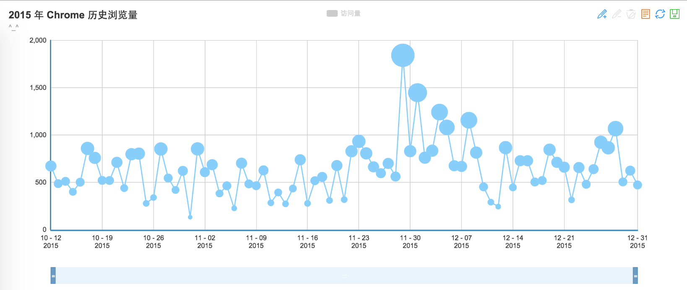
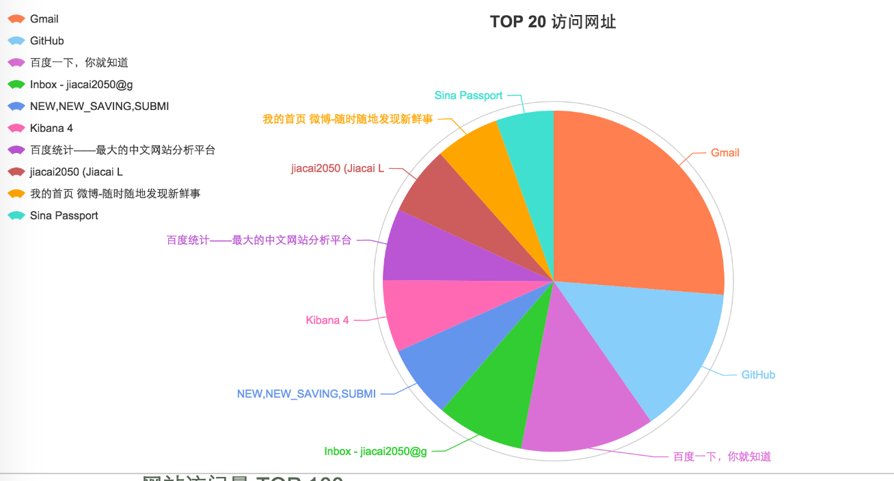
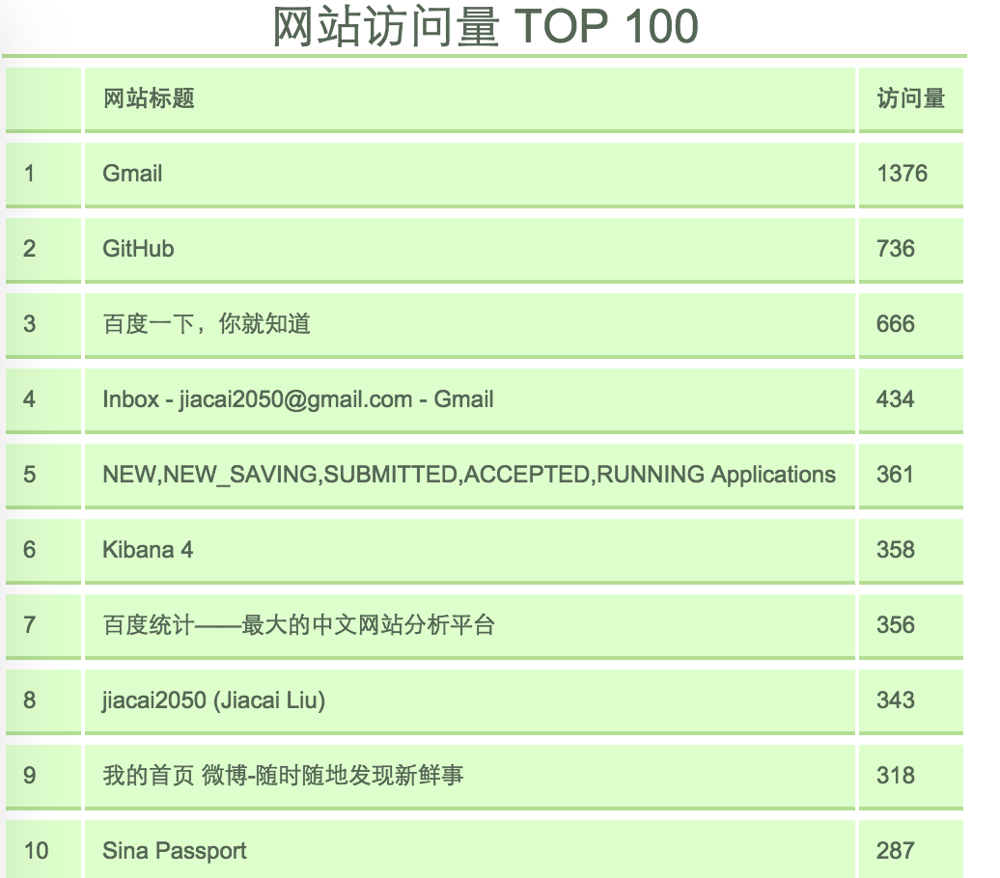

## Chrome 浏览记录统计🔧

新的一年已经到临，相信很多人都有写年终总结，我也是——[《2015 年终总结》](http://liujiacai.net/blog/2016/01/08/review-2015/)。

其实这种总结类的文章最好用数字来说话，和程序员打交道最多的肯定是浏览器，所以如果能够统计、分析出前一年的浏览记录，应该是比较有意义的。所以我针对 Chrome 浏览器，写了这个小工具，便于大家分析自己的浏览记录。

## 功能

1. 使用[ECharts](https://github.com/ecomfe/echarts) + [Express](http://expressjs.com/) 提供基于 canvas 的图表展示
2. 统计高频网址的访问次数，导出到 csv 文件
3. 按天统计历史浏览记录，导出到 csv 文件
4. ...

更多功能，等着你来实现😊


## 使用

### 1. 下载本库，并安装依赖
```
git clone https://github.com/jiacai2050/chrome-history-stat.git && cd chrome-history-stat
npm install
```
### 2. 修改配置文件`config.json`
本库中`config.json`默认为我 Mac 上的配置，你需要根据自己的情况进行修改：
```
{
    "port": 5210,
    "chrome_history_file": "/Users/liujiacai/Desktop/History",
    "export_file" : {
        "countDailyVisits": "/Users/liujiacai/Desktop/countDailyVisits.csv",
        "countURLsFrequence": "/Users/liujiacai/Desktop/countURLsFrequence.csv"
    },
    "count_range": {
        "start": "2015/01/01",
        "end": "2016/01/01"
    }
}
```
其中的`chrome_history_file` 指明 Chrome 保存在本地的历史浏览文件，上面示例为我 Mac 上的位置。在 Chrome 打开的情况下如果直接从默认位置读取，会报下面的错误：
```
{ [Error: SQLITE_BUSY: database is locked] errno: 5, code: 'SQLITE_BUSY' }
```
所以我这里把`History`文件拷贝到了桌面上。各大操作系统`History`文件位置大致如下：

- Linux
    `/home/$USER/.config/google-chrome/Default/History`
- MacOS
    `/Users/$USER/Library/Application Support/Google/Chrome/Default/History`
- Windows XP
    `C:\Documents and Settings\%USERNAME%\Local Settings\Application Data\Google\Chrome\User Data\Default\History`
- Windows Vista 以及之后的版本
    `C:\Users\%USERNAME%\AppData\Local\Google\Chrome\User Data\Default\History`

为了避免上面的错误，大家最好把`History`文件从默认位置拷贝到桌面上再使用。

### 3. 启动服务
修改完`config.json`后，就可以运行我们的服务了：
```
$ node app

# 看到下面的输出，说明服务已经启动了
add router: /chrome
Listening on port 5210 ...
```
服务成功启动后，就可以打开浏览器访问了：http://localhost:5210





### 4. 数据导出
当然，除了在线浏览，还可以把数据导出为 CSV 文件。直接在命令行执行下面的命令：
```
./lib/export.js help    # 查看使用说明
./lib/export.js day     # 按天统计 Chrome 浏览记录，导出到 csv 文件
./lib/export.js mfv     # 统计不同网址的访问次数，导出到 csv 文件
```

导出到 CSV 文件后，就可以使用各种表格工具（如：Numbers、Excel）进行可视化了。在这个 DT 时代，别告诉我你不会用这些工具。

## TODO

- [ ] 提供`搜索关键字`相关信息的展示，信息来源：`History` 文件中的 `keyword_search_terms` 表
- [ ] 提供更丰富的图表展示📈
- [ ] 提供对 Firefox 的分析

## License
[MIT](http://liujiacai.net/license/MIT.html?year=2016)

Echarts 版权归[百度](https://github.com/ecomfe/echarts/blob/master/LICENSE.txt)所有
