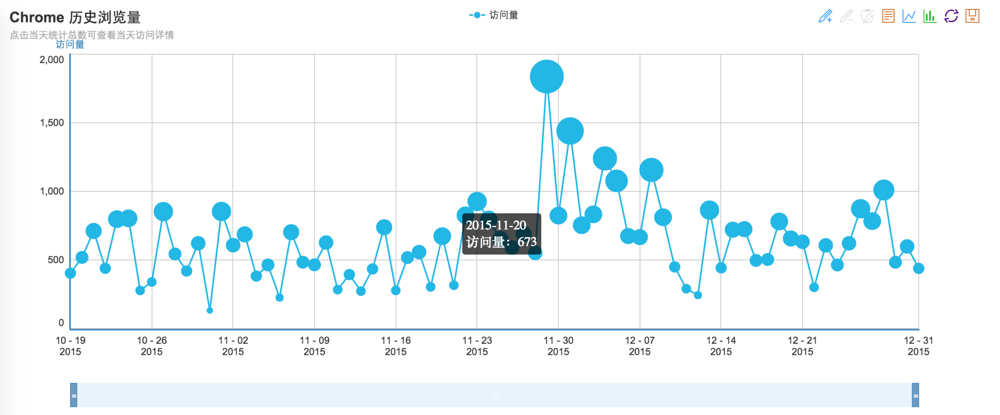
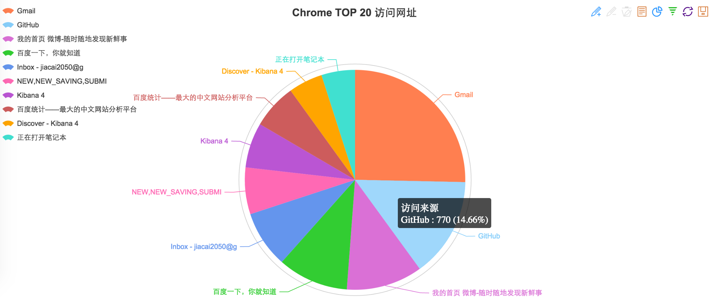

## Chrome/Firefox 浏览记录统计🔧

新的一年已经到临，相信很多人都有写年终总结，我也是——[《2015 年终总结》](http://liujiacai.net/blog/2016/01/08/review-2015/)。

其实这种总结类的文章最好用数字来说话，和程序员打交道最多的肯定是浏览器，所以如果能够统计、分析出前一年的浏览记录，应该是比较有意义的。所以我针对 Chrome/Firefox 浏览器，写了这个小工具，便于大家分析自己的浏览记录。

## 功能

1. 使用 [ECharts](https://github.com/ecomfe/echarts) + [Express](http://expressjs.com/) 提供基于 canvas 的图表展示


2. 导出统计数据到 csv 文件
3. ...

更多功能，等着你来实现 😊


## 使用

### 0. 安装 [Node.js](https://nodejs.org/)

由于本库使用了 ES6 中的 [template strings](https://developer.mozilla.org/en-US/docs/Web/JavaScript/Reference/template_strings) 语法，所以需要安装`v4.0.0`以及之上的版本。

### 1. 下载本库，并安装依赖
```
git clone https://github.com/jiacai2050/chrome-history-stat.git && cd chrome-history-stat
npm install
```
### 2. 启动服务

```
node app

# 看到下面的输出，说明服务已经启动了

找到 Chrome 历史浏览文件：/Users/liujiacai/Library/Application Support/Google/Chrome/Default/History
找到 Firefox 历史浏览文件：/Users/liujiacai/Library/Application Support/Firefox/Profiles/w6gn3vr4.default/places.sqlite
Chrome 数据库初始化成功... 请访问 http://localhost:5210/chrome
Firefox 数据库初始化成功... 请访问 http://localhost:5210/firefox
```

服务启动时，会根据当前操作系统的不同，在 Chrome/Firefox [默认配置文件夹](https://github.com/jiacai2050/ideas/issues/10)中查找历史浏览文件，找到后会将其拷贝到用户家目录，然后再初始化相应数据库。

如果在默认位置找不到或者用户想要显式指定历史浏览文件，可修改`config.json`中相应的参数：

- `chrome_history_file`：Chrome 保存在本地的历史浏览文件
- `firefox_history_file`：Firefox 保存在本地的历史浏览文件

在浏览器打开的情况下，不要直接从默认位置读取历史浏览文件，否则会报下面的错：
```
{ [Error: SQLITE_BUSY: database is locked] errno: 5, code: 'SQLITE_BUSY' }
```

### 3. 数据导出

当然，除了在线浏览，还可以把数据导出为 CSV 文件。直接在命令行执行下面的命令：
```
./lib/export.js help    # 查看使用说明
./lib/export.js chrome  # 导出 Chrome 浏览记录到 csv 文件
./lib/export.js firefox # 导出 Firefox 浏览记录到 csv 文件
```

导出的默认位置为用户家目录，如果用户想要更换导出位置，可修改`config.json`中相应的参数：

- `export_dir`：指定文件导出文件夹

导出到 CSV 文件后，就可以使用各种表格工具（如：Numbers、Excel）进行可视化了。在这个 DT 时代，别告诉我你不会用这些工具。

## TODO

- [x] 提供对 Firefox 的分析。（2016-01-16 完成）
- [x] 提供`搜索关键字`相关信息的展示。个人觉得没什么价值，所以不做了。
- [ ] 提供更丰富的图表展示📈


## License
[MIT](http://liujiacai.net/license/MIT.html?year=2016)

Echarts 版权归[百度](https://github.com/ecomfe/echarts/blob/master/LICENSE.txt)所有